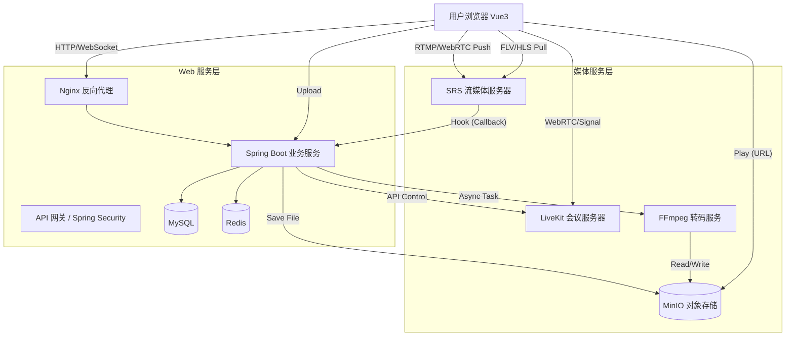

# CombineAuditorium 视频平台开发计划与详细设计

## 1. 项目概述
本项目旨在构建一个集**视频点播 (VOD)**、**直播 (Live Streaming)**、**视频会议 (Video Conferencing)** 于一体的综合视频平台。
- **前端**: Vue 3 + TypeScript + Vite + Pinia + Element Plus
- **后端**: Java (Spring Boot 3)
- **流媒体/中间件**: SRS (Simple Realtime Server) 或 ZLMediaKit, FFmpeg, MinIO (对象存储), Redis, MySQL

---

## 2. 技术栈详细选型

### 2.1 前端 (Web)
- **核心框架**: Vue 3 (Composition API)
- **构建工具**: Vite
- **语言**: TypeScript
- **UI 组件库**: Element Plus (后台管理 & 用户中心) / Ant Design Vue
- **路由管理**: Vue Router 4
- **状态管理**: Pinia
- **视频播放器**: 
  - 点播/直播: Video.js 或 XGPlayer (西瓜播放器)
  - 会议 (WebRTC): 原生 WebRTC API 或 LiveKit-Client SDK
- **网络请求**: Axios

### 2.2 后端 (Java)
- **核心框架**: Spring Boot 3.x
- **ORM**: MyBatis-Plus / Spring Data JPA
- **数据库**: MySQL 8.0
- **缓存**: Redis (存储 Session, 直播间状态, 会议信令)
- **消息队列**: RabbitMQ / Kafka (用于削峰填谷，如视频转码任务通知)
- **对象存储**: MinIO (自建) 或 阿里云OSS (存储视频文件、封面)
- **WebSocket**: Netty 或 Spring Boot WebSocket (用于弹幕、信令交换)

### 2.3 流媒体服务 (核心难点)
- **直播 (Live)**: 推荐使用 **SRS (Simple Realtime Server)**。支持 RTMP 推流，HTTP-FLV/HLS 拉流。
- **点播 (VOD)**: 
  - 上传后使用 **FFmpeg** 进行转码 (转为 H.264/MP4 或 HLS 切片)。
- **会议 (Conference)**: 
  - 方案 A (简单): 使用 P2P WebRTC (适合 1v1 或 3-4 人小规模)。
  - 方案 B (推荐): 集成 **LiveKit** 或 **OpenVidu**。这些是成熟的 SFU (Selective Forwarding Unit) 服务，提供 Java SDK，适合多人会议。

---

## 3. 详细设计

### 3.1 系统架构图 (概念)

### 3.2 数据库设计 (核心表结构草稿)

#### A. 用户表 (`sys_user`)
| 字段名 | 类型 | 描述 |
| :--- | :--- | :--- |
| id | bigint | 主键 |
| username | varchar | 用户名 |
| password | varchar | 加密密码 |
| avatar | varchar | 头像URL |
| role | varchar | 角色 (ADMIN, USER, ANCHOR) |

#### B. 视频信息表 (`video_info`) - 点播
| 字段名 | 类型 | 描述 |
| :--- | :--- | :--- |
| id | bigint | 主键 |
| user_id | bigint | 上传者ID |
| title | varchar | 视频标题 |
| url | varchar | 播放地址 (m3u8/mp4) |
| cover_url | varchar | 封面图 |
| status | int | 状态 (0:转码中, 1:正常, 2:失败) |
| duration | bigint | 时长(秒) |

#### C. 直播间表 (`live_room`) - 直播
| 字段名 | 类型 | 描述 |
| :--- | :--- | :--- |
| id | bigint | 主键 |
| anchor_id | bigint | 主播ID |
| room_code | varchar | 房间号 (唯一) |
| stream_key | varchar | 推流密钥 (用于鉴权) |
| is_live | boolean | 是否正在直播 |
| online_count | int | 在线人数 |

#### D. 会议记录表 (`meeting_session`) - 会议
| 字段名 | 类型 | 描述 |
| :--- | :--- | :--- |
| id | bigint | 主键 |
| host_id | bigint | 主持人ID |
| meeting_code | varchar | 会议号 |
| start_time | datetime | 开始时间 |
| end_time | datetime | 结束时间 |
| password | varchar | 入会密码 (可选) |

### 3.3 核心业务流程

#### (1) 视频点播上传流程
1. 前端选择文件，请求后端获取上传凭证 (或直接上传到后端接口)。
2. 文件存入 MinIO 临时区。
3. 后端发送消息给 MQ，触发 FFmpeg 转码任务。
4. 转换完成后，将生成的文件 (m3u8/ts) 存入正式区。
5. 更新数据库 `video_info` 状态为 "可播放"。

#### (2) 直播流程
1. 主播申请开播，后端生成 `rtmp://server/live/room_code?key=xxx` 推流地址。
2. 主播使用 OBS 或 WebRTC 推流。
3. SRS 收到流，回调后端接口 `on_publish` 进行鉴权 (检查 key)。
4. 鉴权通过，直播开始。
5. 观众访问直播间，前端拉取 HTTP-FLV 或 HLS 流播放。
6. 观众与主播通过 WebSocket 服务发送弹幕。

#### (3) 视频会议流程
1. 用户创建会议，后端调用 LiveKit/OpenVidu API 创建 Room。
2. 返回 Token 给前端。
3. 前端使用 SDK + Token 连接 SFU 服务器。
4. SFU 负责转发各方音视频流。

---

## 4. 开发阶段规划

### 第一阶段：基础设施搭建 (预计 3-5 天)
- [ ] 搭建 Spring Boot 多模块项目 (common, admin, web)。
- [ ] 配置 MySQL, Redis, MinIO 环境 (使用 Docker Compose)。
- [ ] 实现基础的用户注册、登录 (JWT)、权限控制。
- [ ] 搭建 Vue 3 前端脚手架，配置路由和 Pinia。

### 第二阶段：视频点播功能 (VOD) (预计 5-7 天)
- [ ] 集成 MinIO SDK，实现文件分片上传。
- [ ] 集成 FFmpeg (Java Wrapper 如 Jave2 或 命令行调用) 实现视频转码。
- [ ] 前端集成 Video.js 播放器。
- [ ] 视频列表、详情页、评论功能。

### 第三阶段：直播功能 (Live) (预计 5-7 天)
- [ ] 部署 SRS 流媒体服务器。
- [ ] 实现后端生成推流码逻辑。
- [ ] SRS 回调接口开发 (鉴权、状态更新)。
- [ ] 前端直播间页面，集成 FLV.js 或 hls.js 播放器。
- [ ] 基于 WebSocket 的简单聊天室/弹幕系统。

### 第四阶段：视频会议 (Conference) (预计 5-7 天)
- [ ] 部署 LiveKit Server (推荐) 或 OpenVidu。
- [ ] 后端对接会议服务 API (创建房间、生成 Token)。
- [ ] 前端集成 WebRTC 会议 SDK。
- [ ] 实现静音、开关摄像头、屏幕共享功能。

### 第五阶段：整合与优化 (预计 3-5 天)
- [ ] 全局异常处理、日志记录。
- [ ] UI/UX 细节打磨。
- [ ] 压力测试 (JMeter)。
- [ ] 部署上线。

